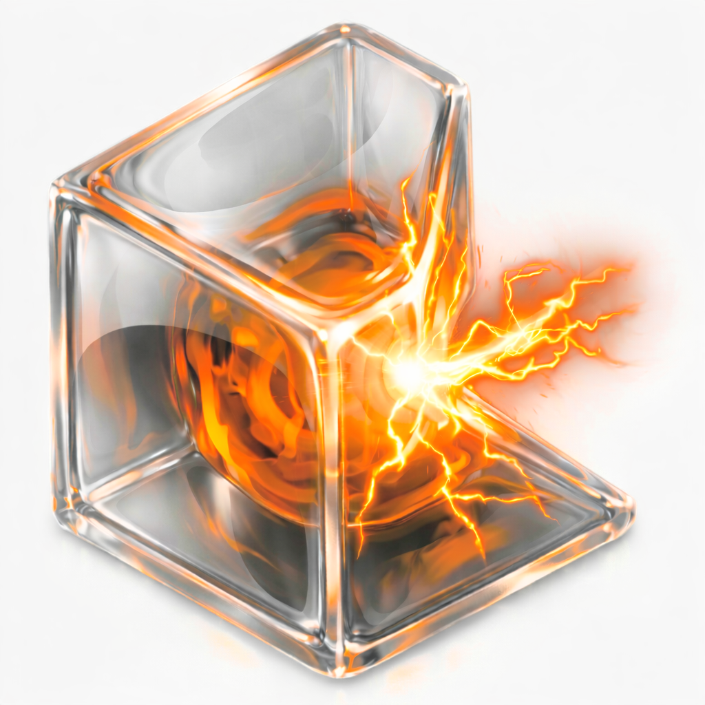

<p align="center">
  
</p>

<h1 align="center">Shard</h1>

<p align="center">
  <strong>A minimal, content-addressed Minecraft launcher</strong><br>
  <em>CLI-first. Reproducible. Zero duplication.</em>
</p>

<p align="center">
  <a href="#features">Features</a> •
  <a href="#installation">Installation</a> •
  <a href="#quick-start">Quick Start</a> •
  <a href="#philosophy">Philosophy</a> •
  <a href="#commands">Commands</a>
</p>

---

## What is Shard?

Shard is a Minecraft launcher that treats your game setup like code: **declarative**, **reproducible**, and **efficient**. Instead of copying mod files everywhere, Shard stores content once and references it by hash — like Git for your Minecraft mods.

- **One mod file, infinite profiles** — mods are stored once, shared across all profiles
- **Profiles are just JSON** — version control your setups, share them, diff them
- **Works offline** — no launcher account required, no telemetry, your data stays local
- **Modrinth & CurseForge** — search, browse, and install from both platforms
- **Fabric & Forge** — loader support with automatic version resolution

## Features

| Feature | Description |
|---------|-------------|
| **Content-Addressed Store** | Mods, resourcepacks, and shaderpacks stored by SHA-256 hash. No duplicates, ever. |
| **Declarative Profiles** | JSON manifests that define exactly what goes into each instance. |
| **Multi-Account** | Multiple Microsoft accounts with secure token storage. |
| **Mod Platforms** | Native Modrinth and CurseForge integration for search and install. |
| **Templates** | Create profiles from reusable templates (Fabric, Forge, vanilla). |
| **Desktop UI** | Clean Tauri-based GUI for those who prefer clicking over typing. |

## Installation

### Prerequisites

- **Rust** (1.75+) — Install via [rustup.rs](https://rustup.rs)
- **Bun** (or Node.js 18+) — For the desktop UI frontend
- **Platform tools:**
  - macOS: Xcode Command Line Tools (`xcode-select --install`)
  - Linux: `build-essential`, `libgtk-3-dev`, `libwebkit2gtk-4.1-dev`, `libappindicator3-dev`
  - Windows: Visual Studio Build Tools with C++ workload

### Build from Source

```bash
# Clone the repository
git clone https://github.com/Th0rgal/shard.git
cd shard

# Build CLI only
cd launcher
cargo build --release
# Binary: target/release/shard

# Build Desktop App
cd desktop
bun install              # Install frontend dependencies
cargo tauri build        # Build production app
# App bundle: desktop/src-tauri/target/release/bundle/
```

### Install or Update

**CLI (all platforms):**
```bash
# Install to ~/.local/bin (add to PATH if needed)
mkdir -p ~/.local/bin
cp target/release/shard ~/.local/bin/

# Or install system-wide (requires sudo)
sudo cp target/release/shard /usr/local/bin/

# Verify installation
shard --version
```

**Desktop App (macOS):**
```bash
# The app bundle is at:
# target/release/bundle/macos/Shard Launcher.app

# Install to Applications (replaces existing)
rm -rf "/Applications/Shard Launcher.app"
cp -r "target/release/bundle/macos/Shard Launcher.app" /Applications/

# Or open directly
open "target/release/bundle/macos/Shard Launcher.app"
```

**Desktop App (Linux):**
```bash
# AppImage (portable)
chmod +x desktop/src-tauri/target/release/bundle/appimage/shard_*.AppImage
./desktop/src-tauri/target/release/bundle/appimage/shard_*.AppImage

# Or install .deb package
sudo dpkg -i desktop/src-tauri/target/release/bundle/deb/shard_*.deb
```

**Desktop App (Windows):**
```powershell
# Run the MSI installer
desktop\src-tauri\target\release\bundle\msi\Shard_*.msi

# Or run the executable directly
desktop\src-tauri\target\release\Shard.exe
```

### Development Mode

```bash
# Run CLI in development
cd launcher && cargo run -- --help

# Run Desktop App with hot reload
cd desktop && bun install && cargo tauri dev
```

## Quick Start

```bash
# Add your Microsoft account
shard account add

# Create a Fabric 1.21.4 profile
shard profile create my-profile --mc 1.21.4 --loader fabric

# Add a mod from Modrinth
shard mod add my-profile sodium

# Launch
shard launch my-profile
```

## Philosophy

Shard is built on five principles:

1. **Single source of truth** — Profiles are declarative manifests. Instances are derived artifacts that can be regenerated anytime.

2. **Deduplication first** — Content lives in a SHA-256 addressed store. Install the same mod in 10 profiles? It's stored once.

3. **Stable and boring** — Plain JSON on disk. Predictable directory layout. No hidden state or magic sync.

4. **Replaceable parts** — Authentication, Minecraft data, and profiles are isolated modules. Swap or extend without breaking everything.

5. **CLI-first** — Every feature works from the command line. Script it, automate it, pipe it.

## Commands

### Profiles
```bash
shard list                                    # List all profiles
shard profile create <id> --mc <version>      # Create profile
shard profile create <id> --mc 1.21.4 --loader fabric
shard profile clone <src> <dst>               # Clone profile
shard profile show <id>                       # Show profile details
shard profile diff <a> <b>                    # Compare profiles
```

### Content
```bash
shard mod add <profile> <file|url|slug>       # Add mod
shard mod remove <profile> <name|hash>        # Remove mod
shard mod list <profile>                      # List mods

shard resourcepack add <profile> <input>      # Add resourcepack
shard shaderpack add <profile> <input>        # Add shaderpack
```

### Store
```bash
shard store search <query>                    # Search Modrinth + CurseForge
shard store search <query> --platform modrinth
shard store info <platform> <project-id>      # Project details
shard store install <profile> <platform> <project-id>
```

### Accounts
```bash
shard account add                             # Add Microsoft account
shard account list                            # List accounts
shard account use <username>                  # Set active account
shard account remove <username>               # Remove account
```

### Launch
```bash
shard launch <profile>                        # Launch game
shard launch <profile> --account <username>   # Launch with specific account
shard launch <profile> --prepare-only         # Prepare without launching
```

## Data Layout

```
~/.shard/
├── store/                    # Content-addressed storage
│   ├── mods/sha256/
│   ├── resourcepacks/sha256/
│   └── shaderpacks/sha256/
├── profiles/                 # Profile manifests
│   └── <id>/profile.json
├── instances/                # Materialized game directories
├── minecraft/                # Versions, libraries, assets
├── accounts.json             # Account tokens (keep private)
└── config.json               # Launcher settings
```

## Configuration

Shard uses Microsoft OAuth for authentication. Set your client credentials via environment or config:

```bash
# Environment variables
export SHARD_MS_CLIENT_ID="your-client-id"
export SHARD_MS_CLIENT_SECRET="your-client-secret"  # if required

# Or via CLI
shard config set-client-id <your-client-id>
```

For CurseForge API access:
```bash
export SHARD_CURSEFORGE_API_KEY="your-api-key"
```

## License

MIT

---

<p align="center">
  <sub>Built by <a href="https://thomas.md">@Th0rgal</a></sub><br>
  <sub>
    <a href="https://oraxen.com">Oraxen</a> •
    <a href="https://hackedserver.org">HackedServer</a> •
    <a href="https://asyncanticheat.com">AsyncAntiCheat</a>
  </sub>
</p>
